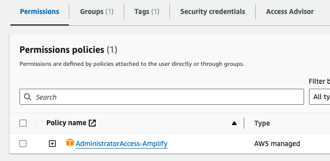

# Training Demo App
Demo react app to showcase Oauth2.0 code grant flow with AWS cognito, API gateway and Amplify.

This project is put together quickly for demo purpuse only. We use create react app and AWS amplify to speed things up. We want to be clear that these tech choice are not desired for a production-grade development.
If you are familiar with Terraform or AWS CDK, feel free to use them to set up the AWS cognito, API gateway and Lambda Function required instead of Amplify.

## Credit
The code is mostly based on Nader Dabit's youtube video. https://www.youtube.com/watch?v=fs9HfYbWjXQ&list=WL&index=5&ab_channel=NaderDabit

## Initial setup required

- A free AWS account

### install the following tools

- aws cli
- amplify cli

### Setup aws profile
- Login to your AWS account via AWS console
- Goto IAM and create and IAM user with aws-managed policy AdministratorAccess-Amplify

- In your local termerial
    - configure your aws cli with your IAM user via access key following the official guide https://docs.aws.amazon.com/cli/latest/userguide/cli-authentication-user.html#cli-authentication-user-configure.title
    - **Note that using access key is NOT recommended for security reason**, however amplify does not work with aws sso user yet https://github.com/aws-amplify/amplify-cli/issues/4488. So we have to use it in this demo app. We recommend removing the access key after this is no longer needed.
    - run aws s3 ls in the terminal to test your aws cli setup
### Initialize the amplify
After cloning the repo, if you haven't provisioned the API gateway, Cognito User Pool and the Lambda. You need to initialize your amplify to provision them. 
- amplify init
    - choose the AWS profile you have setup in previous step with aws cli
- Please follow this youtube video for the to add API gateway, auth and the Lambda.
https://www.youtube.com/watch?v=fs9HfYbWjXQ&list=WL&index=5&ab_channel=NaderDabit

### Continue working on the application
After cloning the repo, if you have already provisioned the AWS resource mentioned above. You can run the following command to regeneate your config (aws-exports.js) and cloudformation in the amplify folder, please choose "changed the backend" when prompted. 
You can find appId and envName in AWS console -> amplify

amplify pull --appId YOUR_APP_ID --envName APP_ENVIROMENT

## install the dependencies
- run yarn install

## Run app in dev mode

- run npm start and open [http://localhost:3000](http://localhost:3000) to view it in your browser.

## Test the Auth flow
- Test if you can register an user via the Create Account Tab in the UI
- Check in AWS console -> Cognito user pool if the user is correctly created
- Test if you can login as this user

